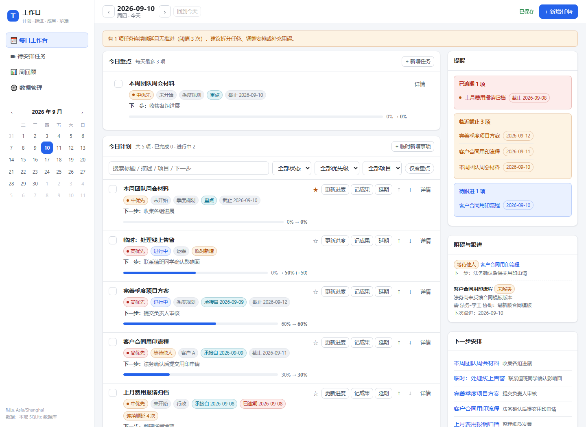

# 工作日程

单人的**本地**工作日程管理应用：每日计划 → 推进记录 → 当日成果 → 跨天承接 → 周回顾。

真实后端 + SQLite 持久化，**数据全部保存在你自己的电脑上**，无账号、无云端同步、无遥测。



## 快速开始

### Windows（推荐：无需任何环境）

1. 获取本项目 —— `git clone`，或从 [Releases](../../releases) 下载免安装 zip（已含 Node 运行时）
2. 双击 **`setup.bat`** —— 自动准备运行时 → 启动服务 → 打开浏览器
3. 以后每天只需双击 **`launch.vbs`**

> 首次运行若项目内没有 `runtime\node.exe`，`setup.bat` 会自动从 nodejs.org 下载（约 40MB，仅一次）。
> 想固定一个桌面快捷方式：`python tools\make_shortcut.py`（可选，需先 `pip install pylnk3`）。
> 需要看启动日志时用 `start-server.bat`（可见控制台，不隐藏窗口）。

### macOS / Linux

需要 Node **>= 22.5**（`node -v` 自检）：

```bash
./start.sh              # 启动服务并打开浏览器
PORT=5174 ./start.sh    # 端口被占用时换端口
```

### 已有 Node 环境（任意平台）

```bash
node server/index.js    # 或 npm start
# 浏览器打开 http://127.0.0.1:5173
```

## 关于后台运行与停止服务

关闭浏览器页面 **不会** 停止服务：前端只是客户端，服务进程仍在后台待命（约 40MB 内存，空闲时基本不耗 CPU），这样下次打开页面是秒开。

需要彻底结束时，点页面右下角（「下一步安排」下方）的 **「停止服务」** 按钮：确认后本机服务进程会退出，页面显示「服务已停止」，此时可以安全关闭标签页。

| 动作 | 服务是否继续运行 |
| --- | --- |
| 关闭标签页 / 浏览器窗口 | 继续运行 |
| 点击页面右下角「停止服务」 | 停止 |
| 重启 / 注销电脑 | 停止 |

- 数据实时写入本地数据库，停止服务不会丢数据；下次双击桌面「工作日程」图标即可重新启动。
- 该接口（`POST /api/system/shutdown`）要求携带 `x-workday-action: shutdown` 请求头，浏览器对非简单请求会先发预检，因此其他网站无法从外部关停本机服务。

## 环境要求

| 项 | 说明 |
| --- | --- |
| Node | **>= 22.5**（使用内置 `node:sqlite`）。Windows 免安装包已自带，无需另装 |
| 依赖 | **零第三方依赖**，不需要 `npm install` |
| 浏览器 | Chrome / Edge / Firefox / Safari 现代版本 |

## 数据存放位置

所有数据都在本机，默认位于项目下的 `data/`：

| 内容 | 路径 |
| --- | --- |
| 主数据库（SQLite，WAL 模式） | `data/workday.db` |
| 附件文件 | `data/attachments/` |
| 导出 / 自动备份 | `data/backups/` |

- 换目录：设 `WORKDAY_DATA_DIR`（整个数据目录）或 `WORKDAY_DB`（仅库文件）。
- 换机器：复制整个 `data/` 目录，或用「数据管理 → 导出备份」生成 ZIP 再导入。
- ⚠️ `workday.db-wal` 含未合并的提交，**不要单独删除**。

## 环境变量

| 变量 | 默认 | 说明 |
| --- | --- | --- |
| `PORT` | `5173` | 监听端口 |
| `HOST` | `127.0.0.1` | 监听地址。改成 `0.0.0.0` 可让同局域网设备访问，**但服务没有任何认证，公网/公共网络慎用** |
| `WORKDAY_DATA_DIR` | `<项目>/data` | 数据目录 |
| `WORKDAY_DB` | `<data>/workday.db` | 数据库文件路径 |
| `TZ` | 系统时区 | 影响"今天"的判定与跨天继承 |
| `WORKDAY_NOW` | 空 | 固定"今天"为指定时间，仅用于测试跨天行为 |

## 项目结构

| | |
| --- | --- |
| 后端 | Node 原生 `node:http` + `node:sqlite`（WAL），REST API，零依赖 |
| 前端 | 原生 ES Module 单页应用，无构建步骤；桌面双栏 / 移动端单列 |
| 启动器 | Windows：`setup.bat` / `launch.vbs` / `start-server.bat`；macOS·Linux：`start.sh` |
| 工具 | `tools/` 运行时安装、打包发布、快捷方式、启动耗时测量 |

主要实体：Task、DailyPlan（日期↔任务，`UNIQUE(task_id, biz_date)`）、ProgressLog、Achievement、Blocker、Attachment、AuditLog、Settings。

## 关键行为

- **跨天继承**：仅在打开当天时触发，为任务新建当日关联（`source=carry`）而非复制任务；已完成/取消/延期未到期/已移出今日不继承；幂等键 + 唯一约束，反复刷新不重复。顺延计数：自上次计划以来无进度且无成果才 +1，达阈值（默认 3）提示拆分。
- **每日快照独立**：今天推到 80%，昨天的日末快照仍为 60%；历史快照可显式修正并留痕，不改写任务当前进度。
- **一致性**：写操作走事务；文本编辑 800ms 防抖自动保存并显示状态；乐观锁版本号，旧版本提交返回 409 不静默覆盖；删除进回收站。
- **备份**：数据管理页导出 ZIP（`backup.json` + 附件 + manifest）；导入前校验预览，支持合并导入或覆盖恢复（自动先备份）。`schemaVersion` 版本化迁移，升级保留记录。
- **停止服务**：每日工作台右下角按钮 → `POST /api/system/shutdown`，先返回响应再优雅关停（`server.close` → 关闭数据库 → 退出），最多 3 秒兜底。

## 开发与测试

```bash
npm test                                 # 18 个自动化用例（继承 / 快照 / 并发 / 备份恢复 / 时区 / 迁移 / 停止服务）
node --test --test-force-exit tests/flow.test.js
python tools/measure_start.py            # 测量服务冷启动耗时
python tools/setup_runtime.py --download # 重新获取私有 Node 运行时
python tools/package_release.py          # 打 Windows 免安装 zip
```

## 边界

无多人协作 / 审批 / 权限体系；浏览器通知仅在页面打开时有效；数据仅在本机，跨设备靠备份 ZIP 手工迁移。

截图见 `docs/`。

## 许可证

[MIT](LICENSE)
